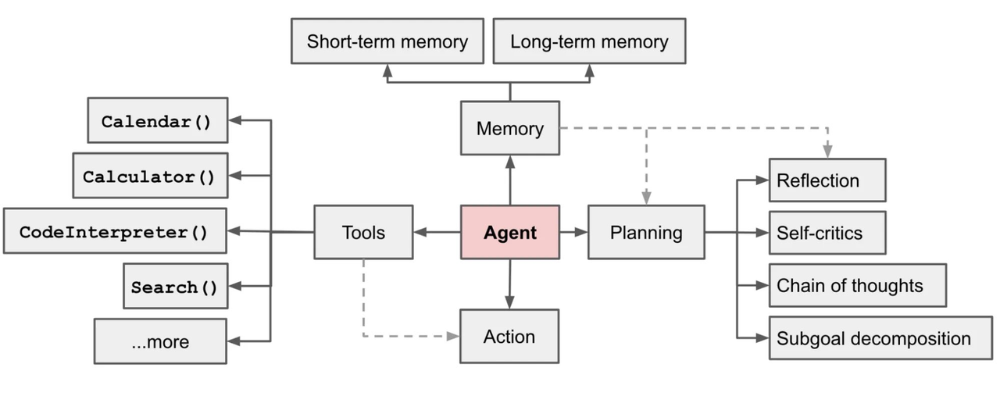
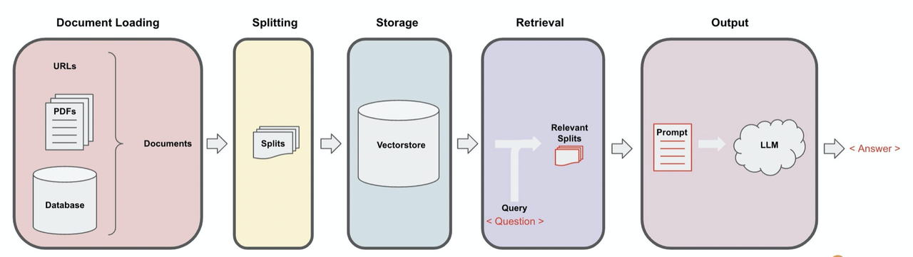

# AI Agents

AI Agent = LLM（大模型） + Planning（规划） + Memory（记忆） + Tools（工具）

## 知识库

大模型并不是100%准确的，它会产生幻觉，主要是因为以下两点
- 训练大模型的数据是有日期限制的，如果你询问大模型超出日期限制的问题，则大模型无法准确回答
- 大模型的数据来源于互联网，如果是公司内部的私有数据，则大模型无法感知

因此知识库的出现就是为了解决大模型的数据准确性的问题。

大模型可以额外学习外接知识库中的知识，从而来精准回复用户。

> 知识库中最典型的一个应用就是客服系统：
>
> 公司可以将用户所有问题以及答案记录在文档中，然后以知识库的形式投喂给大模型。这样当用户通过自然语言询问问题时，大模型就可以根据知识库中的内容给出更加准确的回答。

### 检索增强生成RAG

> 我们都知道大模型的训练数据是有截止日期的，那当我们需要依靠不包含在大模型训练集中的数据时，我们该怎么做呢?

实现这一点的主要方法就是通过检索增强生成RAG，在这个过程中，首先检索外部数据，然后在生成步骤中将这些数据传递给LLM

我们可以将一个RAG的应用抽象为下图的5个过程：

# 参考
1. https://waytoagi.feishu.cn/wiki/CT3UwDM8OiVmOOkohPbcV3JCndb
