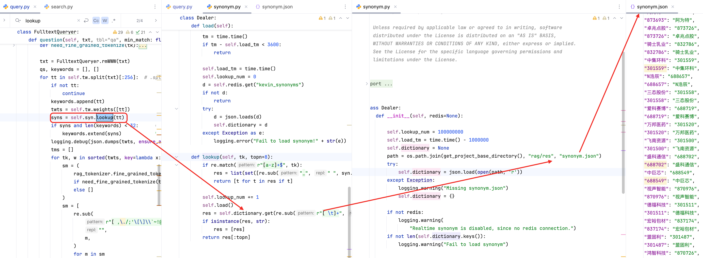

> 由于RAGFlow的代码更新非常频繁，因此强调本文所展示的源码和分析是基于2025/4/2 13:56的代码进行，随着时间的推移可能有所改变

# 多模态检索策略

**相关请求API：**
- POST `/v1/chunk/retrieval_test`
- POST `http://localhost:11434/api/chat`
- POST `/v1/conversation/ask`
- POST `/v1/conversation/related_questions`

**核心步骤：**
用户问题 -> 关键词扩展 -> 向量检索 -> 重排序 -> 知识图谱补充 -> 结果融合


## 关键技术简述

**1.混合召回层**
| 技术  |  算法 |    所在的文件 |
|---|---|---|
| 关键词召回  |  BM25 算法 |    conf/retrieval/bm25 |
|  向量召回 | 双塔模型（sentence-BERT）  | models/embedding/ |
|  全文检索 | Elasticsearch DSL  | service_conf.yaml |

**2.重排序机制**
- 多路分数融合（线性加权/动态调整）
- 基于 Cohere Rerank 的语义相关性优化
- 时效性权重调节（对新闻类文档特殊处理）

**3.缓存优化**
- Redis 缓存高频查询结果（docker-compose-base.yml 包含 Redis 服务）
- 异步预取热点文档向量


## 检索的整体流程分析

初始化数据，包括各种权重配置以及对应的模型，包括
- question: 检索的问题
- kb_ids: 检索的知识库
- similarity_threshold: 相似度阀值，默认为0.2，可以用来过滤低质量结果
- vector_similarity_weight: 向量权重，默认为0.3，调整语义与关键词检索的混合权重
- embd_mdl: 向量模型
- rerank_mdl: 重排序模型
- chat_mdl: 聊天模型（比如deepseek-r1:7b）


### 关键词扩展
通过LLM提取出问题question的关键词，提高召回率
> 召回率是衡量RAG系统性能的关键指标之一，它表示系统能够检索到的相关文档占所有相关文档的比例
```python
if req.get("keyword", False):
    chat_mdl = LLMBundle(kb.tenant_id, LLMType.CHAT)
    question += keyword_extraction(chat_mdl, question)
```

### 向量检索

封装了混合搜索的逻辑
- 向量检索
- 重排序优化

> 具体逻辑在后续小点中展开

```python
ranks = settings.retrievaler.retrieval(
    question,
    embd_mdl,
    ...
    similarity_threshold,
    vector_similarity_weight,
    top,
    doc_ids,
    rerank_mdl=rerank_mdl,
    highlight=highlight,
    rank_feature=label_question(question, kbs)
)
```

### 知识图谱检索增强

将知识图谱检索结果插入到 `ranks`的最前面位置

> 知识图谱领域知识补充，为了解决LLM的幻觉问题


```python
if use_kg:
    ck = settings.kg_retrievaler.retrieval(...)
    ranks["chunks"].insert(0, ck)

    if ck["content_with_weight"]:
        ranks["chunks"].insert(0, ck)
```


### 检索后的数据处理

- 移除 `vector` 字段
- 重命名名称，返回标准化的格式

```python
for c in ranks["chunks"]:
    c.pop("vector", None)
##rename keys
renamed_chunks = []
for chunk in ranks["chunks"]:
    key_mapping = {
        "chunk_id": "id",
        "content_with_weight": "content",
        "doc_id": "document_id",
        "important_kwd": "important_keywords",
        "question_kwd": "questions",
        "docnm_kwd": "document_keyword",
        "kb_id":"dataset_id"
    }
    rename_chunk = {}
    for key, value in chunk.items():
        new_key = key_mapping.get(key, key)
        rename_chunk[new_key] = value
    renamed_chunks.append(rename_chunk)
ranks["chunks"] = renamed_chunks
return get_result(data=ranks)

def get_result(code=settings.RetCode.SUCCESS, message="", data=None):
    if code == 0:
        if data is not None:
            response = {"code": code, "data": data}
        else:
            response = {"code": code}
    else:
        response = {"code": code, "message": message}
    return jsonify(response)
```


## 混合检索核心实现分析

```python
ranks = settings.retrievaler.retrieval()
```

由上面的分析可以知道，我们使用了 `retrieval()` 进行混合检索


在 `rag/nlp/search.py` 的 `retrieval()` 代码逻辑也非常简单：

- **self.search()** ：进行 `向量搜索` 与 `关键词匹配（BM25改进版）` 的混合检索
- **self.rerank_by_model()** / **self.rerand()**：对结果进行重排序
- 重排序后的结果处理：`similarity_threshold` 过滤低质量答案，格式化高亮文本，构建docnm_kwd统计匹配次数，`sorted`根据`count`进行重新排序优化，然后返回处理后的 `ranks`（检索的数据主要放在 `ranks["chunks"]` 数组中

### search()检索

先进行了 `question` 的获取


> self.dataStore = ES/Infinity
**如果question为空**
直接进行全字段搜索（即 `matchExprs` 为空）

**如果question不为空**
- 先使用 `self.qryr.question` 对问题进行处理
- 然后判断向量模型是否存在
  - 如果不存在，`matchExprs` 拼接问题数据，直接对问题进行 `ES/Infinity` 检索
  - 如果存在，则使用 `self.get_vector()` 将问题转化为向量，然后进行 `matchExprs` 的构建（问题、问题向量、权重参数配置），然后进行 `ES/Infinity` 检索
    * 如果结果为空，则放宽 `min_match=0.1` （关键词阈值）和降低 `similarity=0.7`（向量相似度要求）再度进行检索
- 对提取出来的问题关键字 `keywork` 匹配搜索出来的内容进行高亮显示
- 按照 `docnm_kwd` 字段统计文档命中次数
- 返回 `return self.SearchResult(query_vector=q_vec, ...)` 格式化好的object数据

> 向量与关键词权重设为0.05:0.95，侧重语义匹配

```python
def search()
    qst = req.get("question", "")
    if not qst:
        res = self.dataStore.search(src, [], filters, [], orderBy, offset, limit, idx_names, kb_ids)
        total = self.dataStore.getTotal(res)
    else:
        highlightFields = ["content_ltks", "title_tks"] if highlight else []
        matchText, keywords = self.qryr.question(qst, min_match=0.3)
        if emb_mdl is None:
            matchExprs = [matchText]
            res = self.dataStore.search(src, highlightFields, filters, matchExprs, orderBy, offset, limit,
                                idx_names, kb_ids, rank_feature=rank_feature)
        else:
            matchDense = self.get_vector(qst, emb_mdl, topk, req.get("similarity", 0.1))
            q_vec = matchDense.embedding_data
            src.append(f"q_{len(q_vec)}_vec")
            fusionExpr = FusionExpr("weighted_sum", topk, {"weights": "0.05, 0.95"})
            matchExprs = [matchText, matchDense, fusionExpr]

            res = self.dataStore.search(src, highlightFields, filters, matchExprs, orderBy, offset, limit,
                                        idx_names, kb_ids, rank_feature=rank_feature)
            if total == 0:
                matchText, _ = self.qryr.question(qst, min_match=0.1)
                matchDense.extra_options["similarity"] = 0.17
                res = self.dataStore.search(src, highlightFields, filters, [matchText, matchDense, fusionExpr],
                                    orderBy, offset, limit, idx_names, kb_ids, rank_feature=rank_feature)
```


#### self.qryr.question扩展问题

传入查询的问题文本，进行一系列的处理：
- 输入预处理：`移除标点、换行符等噪声，全角转半角` + `去除中英文常见虚词和语气词`
- 存在非中文词语时处理
- 只存在中文词语时处理

##### 输入预处理

标准化输入格式（全角转半角、停用词过滤）

```python
txt = re.sub(
    r"[ :|\r\n\t,，。？?/`!！&^%%()\[\]{}<>]+",
    " ",
    rag_tokenizer.tradi2simp(rag_tokenizer.strQ2B(txt.lower())),
).strip()
txt = FulltextQueryer.rmWWW(txt)
```

停用词过滤 `rmWWW()` ：
- 中文停用词过滤：`"请问什么是深度学习"` -> `"深度学习"`
- 英语疑问词过滤：`"whatis"` -> `"is"`
- 英文停用词清除：`"The book"` -> `"book"`

```python
@staticmethod
def rmWWW(txt):
    patts = [
        (
            r"是*(什么样的|哪家|一下|那家|请问|啥样|咋样了|什么时候|何时|何地|何人|是否|是不是|多少|哪里|怎么|哪儿|怎么样|如何|哪些|是啥|啥是|啊|吗|呢|吧|咋|什么|有没有|呀|谁|哪位|哪个)是*",
            "",
        ),
        (r"(^| )(what|who|how|which|where|why)('re|'s)? ", " "),
        (
            r"(^| )('s|'re|is|are|were|was|do|does|did|don't|doesn't|didn't|has|have|be|there|you|me|your|my|mine|just|please|may|i|should|would|wouldn't|will|won't|done|go|for|with|so|the|a|an|by|i'm|it's|he's|she's|they|they're|you're|as|by|on|in|at|up|out|down|of|to|or|and|if) ",
            " ")
    ]
    otxt = txt
    for r, p in patts:
        txt = re.sub(r, p, txt, flags=re.IGNORECASE)
    if not txt:
        txt = otxt
    return txt
```

通过非英文词汇占比是否超过0.7来判断是否是中文
```python
def question(self, txt, tbl="qa", min_match: float = 0.6):
    txt = re.sub(
        r"[ :|\r\n\t,，。？?/`!！&^%%()\[\]{}<>]+",
        " ",
        rag_tokenizer.tradi2simp(rag_tokenizer.strQ2B(txt.lower())),
    ).strip()
    txt = FulltextQueryer.rmWWW(txt)

    if not self.isChinese(txt):
        #...

def isChinese(line):
    arr = re.split(r"[ \t]+", line)
    if len(arr) <= 3:
        return True
    e = 0
    for t in arr:
        if not re.match(r"[a-zA-Z]+$", t):
            e += 1
    return e * 1.0 / len(arr) >= 0.7
```

接下来会区分两种状态，进行**中文**和**非中文**的区分处理

##### 存在非中文时

**词频权重计算：** 通过`rag_tokenizer.tokenize(txt)`进行分词，通过`tw.weights`获取 `TF-IDF`值

> TF（词频）：某个词在文章中出现次数 / 文章的总词数，也就是出现词的次数越多，则该值越大
>
> IDF（逆文档频率）：与 `语料库的文档总数 / 包含该词的文档数` 的值成正比，也就是出现词的次数越多，则该值越小

```python
tks = rag_tokenizer.tokenize(txt).split()
tks_w = self.tw.weights(tks, preprocess=False)
```

然后对 `tks_w` 进行：
- 删除特殊字符：空格、反斜杠（\）、双引号（"）、单引号（'）、脱字符（^）
- 删除单字符的小写字母或者数字，比如 "a" -> "" ， "3" -> "" , "an" -> "an" 
- 删除开头的加号或者减号
- 删除首尾空格 + 去除内容为空字符串的数据

```python
tks_w = [(re.sub(r"[ \\\"'^]", "", tk), w) for tk, w in tks_w]
tks_w = [(re.sub(r"^[a-z0-9]$", "", tk), w) for tk, w in tks_w if tk]
tks_w = [(re.sub(r"^[\+-]", "", tk), w) for tk, w in tks_w if tk]
tks_w = [(tk.strip(), w) for tk, w in tks_w if tk.strip()]
```


**对获取到的词频权重进行遍历**
- 使用 `self.syn.lookup()` 获取同义词
- 对获取到的同义词进行分词，并且加入到 `keywords` 中
- 同义词的权重降低为原来词语的 `w/4`，即 `1/4`：`syn = ["\"{}\"^{:.4f}".format(s, w / 4.) for s in syn if s.strip()]`
- 最终将同义词组成字符格式放入到 `syns` 中
- 原始词（`tk`)、权重（`w`)、同义词（`syn`)组合成查询表达式
- 使用 `q.append(...)` 进行相邻短语的生成
- `q.append(txt)` 加入原始完整词语 `txt`
- `query = " ".join(q)` 处理最终结果，然后返回一个对象数据 `MatchTextExpr` 和 `keywords`


```python
txt = FulltextQueryer.rmWWW(txt)
tks = rag_tokenizer.tokenize(txt).split()
keywords = [t for t in tks if t]
syns = []

for tk, w in tks_w[:256]:
    syn = self.syn.lookup(tk)
    syn = rag_tokenizer.tokenize(" ".join(syn)).split()
    keywords.extend(syn)
    syn = ["\"{}\"^{:.4f}".format(s, w / 4.) for s in syn if s.strip()]
    syns.append(" ".join(syn))

q = ["({}^{:.4f}".format(tk, w) + " {})".format(syn) for (tk, w), syn in zip(tks_w, syns) if
        tk and not re.match(r"[.^+\(\)-]", tk)]

for i in range(1, len(tks_w)):
    q.append(
        '"%s %s"^%.4f'
        % (
            tks_w[i - 1][0],
            tks_w[i][0],
            max(tks_w[i - 1][1], tks_w[i][1]) * 2,
        )
    )
if not q:
    q.append(txt)
query = " ".join(q)
return MatchTextExpr(
    self.query_fields, query, 100
), keywords
```

> 上面流程有一些细节方法还是比较复杂，下面我们将针对上面的细节小点具体展开分析

**self.syn.lookup()：获取同义词**
如果匹配纯小字母的 `tk`，则
- 通过 `wordnet.synsets()` 获取跨语言同义词集
- `syn.name().split(".")[0]` 提取出基础词性，比如 `word.a.01` -> `word`
- 下划线替换为空格：`re.sub("_", " ", xx)`
- set集合去除原来的词语 `tk`
- 返回当前处理好的同义词数组

> omw-1.4是自然语言处理工具库NLTK中一个重要的多语言语料库，通过 `wordnet.synsets()` 获取跨语言同义词集（例如中文"汽车"对应英语"car"）

```python
def lookup(self, tk, topn=8):
    if re.match(r"[a-z]+$", tk):
        res = list(set([re.sub("_", " ", syn.name().split(".")[0]) for syn in wordnet.synsets(tk)]) - set([tk]))
        return [t for t in res if t]

    self.lookup_num += 1
    self.load()
    res = self.dictionary.get(re.sub(r"[ \t]+", " ", tk.lower()), [])
    if isinstance(res, str):
        res = [res]
    return res[:topn]
```

如果不是纯小字母的 `tk`，则通过 `self.dictionary.get()` 从同义词文件中加载出对应的数据，如果超过了 `topn`，则进行结果截断

> `re.sub(r"[ \t]+", " ", tk.lower())` 合并连续空白符




-------

**原始词（`tk`)、权重（`w`)、同义词（`syn`)组合成查询表达式：**

- 通过 `re.match(r"[.^+\(\)-]", tk)` 排除包含特殊字符的词项（包括 `.`、`^`、`+`、`()`、`-`)
- 第一个 `format` 保留4位小数，如 `0.63232323` -> `0.6323`，并且使用 `^` 拼接字符串
- 第二个 `format` 实现 字符串的空格 拼接

> 整体流程如下面代码中的实例所示

```python
q = ["({}^{:.4f}".format(tk, w) + " {})".format(syn) for (tk, w), syn in zip(tks_w, syns) if
        tk and not re.match(r"[.^+\(\)-]", tk)]

# 示例
tks_w = [("data", 0.6), 
         ("analysis", 0.9), 
         ("machine+learning", 0.85)]  # 原始词项及权重
syns = ["dataset", "statistics", "AI"]  # 对应的同义词
q = [
    "(data^0.6000 dataset)",
    "(analysis^0.9000 statistics)",
    # "machine+learning"存在非法符号+被排除
]
```

-------

**组合相邻短语：**
继续使用上面的示例，从下面示例我们可以看出，就是从 `index=1` 开始遍历，然后不断组合 `前后两个单词` + `两个单词最大权重的数字 * 2`

```python
for i in range(1, len(tks_w)):
    q.append(
        '"%s %s"^%.4f'
        % (
            tks_w[i - 1][0],
            tks_w[i][0],
            max(tks_w[i - 1][1], tks_w[i][1]) * 2,
        )
    )

# 示例
result = [
    '"data analysis"^1.8000',  # max(0.6, 0.9)*2=1.8
    '"analysis machine_learning"^1.7000'  # max(0.9, 0.85)*2=1.7
]
```


##### 只存在中文时


由于这个流程比较复杂，因此我们先熟悉两个方法的具体逻辑
- self.tw.split(txt)
- fine_grained_tokenize()

**self.tw.split(txt)：** 分割文本时保留复合词或者实体，同时避免破坏函数名等关键标识符

合并连续空格/制表符尾 -> 单个空格 => split(空格)进行切分
- 如果前一个单词以字母结尾 + 当前单词以字母结尾 + 当前单词不是函数名称 + 前一个单词名称不是函数名称，则进行合并，比如"Hello World" => "Hello World"
- 如果不符合上面的情况，则需要切割，形成两个字符存放在 `thk` 中，比如"Hello functionNameOne" => '["Hello", "functionNameOne"]'

> `self.ne.get(t, "")` 也是一个文件的JSON数据的解析

```python
def split(self, txt):
    tks = []
    for t in re.sub(r"[ \t]+", " ", txt).split():
        if tks and re.match(r".*[a-zA-Z]$", tks[-1]) and \
            re.match(r".*[a-zA-Z]$", t) and tks and \
            self.ne.get(t, "") != "func" and self.ne.get(tks[-1], "") != "func":
            tks[-1] = tks[-1] + " " + t
        else:
            tks.append(t)
    return tks

# self.ne的来源
fnm = os.path.join(get_project_base_directory(), "rag/res")
self.ne, self.df = {}, {}
try:
    self.ne = json.load(open(os.path.join(fnm, "ner.json"), "r"))
```


**fine_grained_tokenize()：**

首先判断不需要分词的情况，直接返回
- 如果中文占比小于0.2：`if zh_num < len(tks) * 0.2`
- 如果长度小于3+纯数字加逗号、横线、点(比如"12,345.67-89") 或者 长度大于10：`if len(tk) < 3 or re.match(r"[0-9,\.-]+$", tk)` + `if len(tk) > 10`

当遇到需要分词的情况时
- 递归生成所有可能的分词结果：`self.dfs_(tk, 0, [], tkslist)` => `dfs_`使用`self.trie`（也就是 `rag/res/huqie.txt.trie`预定义词库）快速匹配
- 对所有结果进行评分：`B / len(tks) + L + F`，即基于词频权重 + 词长进行评分
- 优先选择高频词组合
- 最终进行英文数据的标准化，比如 "cats"-> "cat"等等


```python
def fine_grained_tokenize(self, tks):
    tks = tks.split()
    zh_num = len([1 for c in tks if c and is_chinese(c[0])])
    if zh_num < len(tks) * 0.2:
        res = []
        for tk in tks:
            res.extend(tk.split("/"))
        return " ".join(res)

    res = []
    for tk in tks:
        if len(tk) < 3 or re.match(r"[0-9,\.-]+$", tk):
            res.append(tk)
            continue
        tkslist = []
        if len(tk) > 10:
            tkslist.append(tk)
        else:
            self.dfs_(tk, 0, [], tkslist)
        if len(tkslist) < 2:
            res.append(tk)
            continue
        stk = self.sortTks_(tkslist)[1][0]
        if len(stk) == len(tk):
            stk = tk
        else:
            if re.match(r"[a-z\.-]+$", tk):
                for t in stk:
                    if len(t) < 3:
                        stk = tk
                        break
                else:
                    stk = " ".join(stk)
            else:
                stk = " ".join(stk)

        res.append(stk)

    return " ".join(self.english_normalize_(res))

def sortTks_(self, tkslist):
    res = []
    for tfts in tkslist:
        tks, s = self.score_(tfts)
        res.append((tks, s))
    return sorted(res, key=lambda x: x[1], reverse=True)
def score_(self, tfts):
    B = 30
    F, L, tks = 0, 0, []
    for tk, (freq, tag) in tfts:
        F += freq
        L += 0 if len(tk) < 2 else 1
        tks.append(tk)
    #F /= len(tks)
    L /= len(tks)
    logging.debug("[SC] {} {} {} {} {}".format(tks, len(tks), L, F, B / len(tks) + L + F))
    return tks, B / len(tks) + L + F
```

回到我们对中文问题的流程讨论

首先对文本进行了切割：`for tt in self.tw.split(txt)[:256]:`

然后遍历所有切割出来的单词 `tt`
- 记录目前切割的数据：`keywords.append(tt)`
- 获取该词的权重数组：`twts = self.tw.weights([tt])`
- 获取该词的同义词：`syns = self.syn.lookup(tt)`
- 添加同义词数组 `syns` 到 `keyworks`

----

- 然后按照 `权重降序` 排序（因为切割出来的可能是多个词），然后对目前的词 `tk` 再进行细粒度分词：`rag_tokenizer.fine_grained_tokenize(tk).split()` 得到 `sm` 数组
- 对 `sm` 数组去除特殊字符，然后添加到 `keyworks` 中
  
----


- 对当前的词 `tk` 获取它的同义词：`tk_syns = self.syn.lookup(tk)`
- 去除特殊字符后，加入到  `keyworks` 中
  

----

- 遍历所有同义词 `tk_syns`，进行细粒度分词：`tk_syns = [rag_tokenizer.fine_grained_tokenize(tk_syns的item).split()]`
- 遍历所有`tk_syns`，如果某一个 `item` 是有空格的，比如 `Hello World` -> `"Hello World"`，则加上引号 ==> 提升精确匹配
- 使用 `OR` 连接原始词+同义词（权重^0.2）：`tk = f"({tk} OR (%s)^0.2)" % " ".join(tk_syns)`
- 然后将 `tk` 存放在 `tms` 中
-----

最终进行数据的拼接：各种权重的配置拼接

```python
tms = " ".join([f"({t})^{w}" for t, w in tms])
if len(twts) > 1:
    tms += ' ("%s"~2)^1.5' % rag_tokenizer.tokenize(tt)
syns = " OR ".join(
            [
                '"%s"'
                % rag_tokenizer.tokenize(FulltextQueryer.subSpecialChar(s))
                for s in syns
            ]
        )
if syns and tms:
    tms = f"({tms})^5 OR ({syns})^0.7"

qs.append(tms)

if qs:
    query = " OR ".join([f"({t})" for t in qs if t])
    return MatchTextExpr(
        self.query_fields, query, 100, {"minimum_should_match": min_match}
    ), keywords
```

#### self.get_vector转化原始问题为向量

直接使用向量模型转化问题为向量，检查维度 `shape` 是否为 1，然后将向量数据转化为 `float` 数据数组，动态生成向量列名：`q_{向量长度}_vec`

```python
def get_vector(self, txt, emb_mdl, topk=10, similarity=0.1):
    qv, _ = emb_mdl.encode_queries(txt)
    shape = np.array(qv).shape
    if len(shape) > 1:
        raise Exception(
            f"Dealer.get_vector returned array's shape {shape} doesn't match expectation(exact one dimension).")
    embedding_data = [get_float(v) for v in qv]
    vector_column_name = f"q_{len(embedding_data)}_vec"
    return MatchDenseExpr(vector_column_name, embedding_data, 'float', 'cosine', topk, {"similarity": similarity})
```

#### self.dataStore.search使用原始问题向量和扩展问题后的数据进行检索

`this.dataStore`本质就是 `ES/Infinity`，直接调用了对应的 `search()` 方法进行检索
> 当然也是经过封装过的，比如 `rag/utils/es_conn.py` 会再封装一层 `search()` 方法

```python
if lower_case_doc_engine == "elasticsearch":
    docStoreConn = rag.utils.es_conn.ESConnection()
elif lower_case_doc_engine == "infinity":
    docStoreConn = rag.utils.infinity_conn.InfinityConnection()
else:
    raise Exception(f"Not supported doc engine: {DOC_ENGINE}")

retrievaler = search.Dealer(docStoreConn)
```

-----


### 重排序

经过上面 `search()检索` 之后，我们从 `ES/Infinity` 中得到数据，然后对得到的结果进行重排序

结合向量（语义）和文本（关键词）相似度，平衡精确匹配和语义泛化

**不使用大模型：** 
- 当前问题question的向量 和 当前检索到的文档的向量 计算余弦相似度 => 向量（语义）相似度
- 当前问题question（分词 => 转权重字典）和 当前文档（分词 => 转权重字典）=> 文本（关键词）相似度 => 本质就是计算关键词出现的频次
  - 查询分词：`["汽车", "显示屏", "黑屏", "解决"]` → 权重字典`{"汽车":0.8, "显示屏":1.2, "黑屏":1.5, "解决":0.6}`
  - 文档1分词：`["长按", "电源键", "强制重启", "黑屏"]` → 权重字典`{"电源键":0.7, "黑屏":1.2, ...}`

**使用大模型：**
- 调用深度学习模型计算语义相似度
- 当前问题question（分词 => 转权重字典）和 当前文档（分词 => 转权重字典）=> 文本（关键词）相似度 => 本质就是计算关键词出现的频次


#### rerank()

如下面代码所示
- 对查询问题进行扩展，获取对应的同义词集合 `keywords`：`self.qryr.question(query)`
- 遍历结果 `sres.ids`，拿到对应的向量数据，添加到 `ins_embd`中
- 再次遍历 `sres.ids`，提取对应的文本特征（包括标题、内容、关键词），拿到对应的数组集合（内容分词数组、标题分词数组、预定义重要关键词数组），然后进行加权组合特征 `tks = content_ltks + title_tks * 2 + important_kwd * 5 + question_tks * 6`
- 调用 `self.qryr.hybrid_similarity()` 得到向量相似度 `vtsim` 和文本相似度 `tksim`
- 调用 `self._rank_feature_scores()`获取基于标签的排序特征，获取最终得分 `sim` + `rank_fea`
- 返回 得分，文本相似度，向量相似度：`return sim + rank_fea, tksim, vtsim`


```python
def rerank(self, sres, query, tkweight=0.3,
            vtweight=0.7, cfield="content_ltks",
            rank_feature: dict | None = None
            ):
    _, keywords = self.qryr.question(query)
    vector_size = len(sres.query_vector)
    vector_column = f"q_{vector_size}_vec"
    zero_vector = [0.0] * vector_size
    ins_embd = []
    for chunk_id in sres.ids:
        vector = sres.field[chunk_id].get(vector_column, zero_vector)
        if isinstance(vector, str):
            vector = [get_float(v) for v in vector.split("\t")]
        ins_embd.append(vector)
    if not ins_embd:
        return [], [], []

    for i in sres.ids:
        if isinstance(sres.field[i].get("important_kwd", []), str):
            sres.field[i]["important_kwd"] = [sres.field[i]["important_kwd"]]
    ins_tw = []
    for i in sres.ids:
        content_ltks = list(OrderedDict.fromkeys(sres.field[i][cfield].split()))
        title_tks = [t for t in sres.field[i].get("title_tks", "").split() if t]
        question_tks = [t for t in sres.field[i].get("question_tks", "").split() if t]
        important_kwd = sres.field[i].get("important_kwd", [])
        tks = content_ltks + title_tks * 2 + important_kwd * 5 + question_tks * 6
        ins_tw.append(tks)

    ## For rank feature(tag_fea) scores.
    rank_fea = self._rank_feature_scores(rank_feature, sres)

    sim, tksim, vtsim = self.qryr.hybrid_similarity(sres.query_vector,
                                                    ins_embd,
                                                    keywords,
                                                    ins_tw, tkweight, vtweight)

    return sim + rank_fea, tksim, vtsim

def hybrid_similarity(self, avec, bvecs, atks, btkss, tkweight=0.3, vtweight=0.7):
    from sklearn.metrics.pairwise import cosine_similarity as CosineSimilarity
    import numpy as np

    sims = CosineSimilarity([avec], bvecs)
    tksim = self.token_similarity(atks, btkss)
    if np.sum(sims[0]) == 0:
        return np.array(tksim), tksim, sims[0]
    return np.array(sims[0]) * vtweight + np.array(tksim) * tkweight, tksim, sims[0]
```


#### rerank_by_model()

本质跟 `rereank()`逻辑差不多，也是通过向量（语义）和 文本（关键词）进行综合得分计算

在 `rerank_by_model()`中，使用 `rerank_mdl.similarity` 代替 `CosineSimilarity([avec], bvecs)` 获取语义向量相似度

然后其它逻辑跟 `rereank()` 逻辑大致一致：
- 遍历 `sres.ids`，提取对应的文本特征（包括标题、内容、关键词），拿到对应的数组集合（内容分词数组、标题分词数组、预定义重要关键词数组），然后进行加权组合特征 `tks = content_ltks + title_tks + important_kwd`，放入到 `ins_tw`数组中
- 使用 `self.qryr.token_similarity()` 计算出文本（关键词）相似度
- 调用 `self._rank_feature_scores()`获取基于标签的排序得分
- 最终将 向量（语义）相似度、 文本（关键词）相似度、基于标签的排序得分以一定权重组合起来计算出最终的得分

```python
def rerank_by_model(self, rerank_mdl, sres, query, tkweight=0.3,
                    vtweight=0.7, cfield="content_ltks",
                    rank_feature: dict | None = None):
    _, keywords = self.qryr.question(query)

    for i in sres.ids:
        if isinstance(sres.field[i].get("important_kwd", []), str):
            sres.field[i]["important_kwd"] = [sres.field[i]["important_kwd"]]
    ins_tw = []
    for i in sres.ids:
        content_ltks = sres.field[i][cfield].split()
        title_tks = [t for t in sres.field[i].get("title_tks", "").split() if t]
        important_kwd = sres.field[i].get("important_kwd", [])
        tks = content_ltks + title_tks + important_kwd
        ins_tw.append(tks)

    tksim = self.qryr.token_similarity(keywords, ins_tw)
    vtsim, _ = rerank_mdl.similarity(query, [rmSpace(" ".join(tks)) for tks in ins_tw])
    ## For rank feature(tag_fea) scores.
    rank_fea = self._rank_feature_scores(rank_feature, sres)

    return tkweight * (np.array(tksim)+rank_fea) + vtweight * vtsim, tksim, vtsim
```


> 至于 `token_similarity()` 是如何计算出相似度的以及 `_rank_feature_scores()` 是如何计算出标签的特征得分，我们将在最下面的核心方法剖析中讲解


# 总结（尝试总结，目前不精准）

## 上传
1. OCR/布局/表格模型获取当前文件的内容
2. 将内容转化为chunk进行向量存储

## 检索
1. 询问问题时进行问题的同义词扩展，拼接 OR 查询表达式 + 权重
2. 问题直接使用 `ES/Infinity` 进行询问得到对应的 `chunk` 片段
3. 重排序（不使用大模型）：【根据当前问题的向量 + 对应的 `chunk` 片段的向量 进行语义比较】+ 【标题/内容的BM25关键词频次比较】 得出分数
4. 重排序（使用大模型）：【使用大模型进行语义比较】 + 【标题/内容的BM25关键词频次比较】 得出分数


# 核心方法剖析

## 检索

### self.tw.weights()获取分词的权重


## 重排序

### token_similarity()

当 `atks` = `手机 显示屏 黑屏 解决`时，经过 `toDict()` 会得到：`{"手机": 0.4, "显示屏": 1.2, "黑屏": 1.5, "解决": 0.6}`

当 `btkss` = `中央 显示屏 黑屏 电源键 强制重启`时，经过 `toDict()` 会得到：`{"中央": 0.3, "显示屏": 1.0, "黑屏": 1.2, "电源键": 0.7, "强制重启": 0.9}`

```python
def token_similarity(self, atks, btkss):
    def toDict(tks):
        if isinstance(tks, str):
            tks = tks.split()
        d = defaultdict(int)
        wts = self.tw.weights(tks, preprocess=False)
        for i, (t, c) in enumerate(wts):
            d[t] += c_rank_feature_scores
        return d

    atks = toDict(atks)
    btkss = [toDict(tks) for tks in btkss]
    return [self.similarity(atks, btks) for btks in btkss]
```

经过 `self.tw.weights()` 计算出当前分词的权重，构建出 `{"手机": 0.4}` 的数据结构

然后进行关键词匹配，即 `qtwt` 的关键词 一定得存在于 `dtwt` 中，比如上面的 `atks` 和 `btkss` 都有 `显示屏` 这个词

然后进行
- 词项权重乘积相加 => 衡量词项匹配度
- 查询向量模长归一化​得到 `q`  => 调节得分范围
- 文档长度惩罚（这个惩罚项用于调整较长的文档的相关性评分，以避免较长的文档在评分中占据过大的比重）：`math.log10( len(dtwt.keys()) + 512 )`   => 抑制长文档的天然优势
- 计算出最终得分：sqrt( 3 * (词项权重乘积相加 / 查询向量模长归一化 / 文档长度惩罚) )

> 详细可以参考 `BM25` 相关算法

```python
def similarity(self, qtwt, dtwt):
    if isinstance(dtwt, type("")):
        dtwt = {t: w for t, w in self.tw.weights(self.tw.split(dtwt), preprocess=False)}
    if isinstance(qtwt, type("")):
        qtwt = {t: w for t, w in self.tw.weights(self.tw.split(qtwt), preprocess=False)}
    s = 1e-9
    for k, v in qtwt.items():
        if k in dtwt:
            s += v * dtwt[k]
    q = 1e-9
    for k, v in qtwt.items():
        q += v * v
    return math.sqrt(3. * (s / q / math.log10( len(dtwt.keys()) + 512 )))
```


### _rank_feature_scores()

根据两个权重进行得分的计算
- TAG_FLD：文档内容与用户查询标签的语义匹配度
- PAGERANK_FLD


- 遍历所有的搜索结果 `search_res.ids`，判断检索到的 `chunk` 是否有 `PAGERANK_FLD` 字段，添加到 `pageranks` 中
- 如果没有标签特征，也就是没有 `query_rfea` ，则仅返回 `PageRank` 分数
- 如果有传入 `query_rfea`，遍历所有检索到的文档
  - 如果文档没有标签，则得分为0：`rank_fea.append(0)`
  - 如果文档有标签，则解析标签，进行 标签得分累积相加 => 文档模长平方 => 归一化处理（调节得分范围），最终计算出得分 `标签分 * 10 + PageRank分`

```python
def _rank_feature_scores(self, query_rfea, search_res):
    ## For rank feature(tag_fea) scores.
    rank_fea = []
    pageranks = []
    for chunk_id in search_res.ids:
        pageranks.append(search_res.field[chunk_id].get(PAGERANK_FLD, 0))
    pageranks = np.array(pageranks, dtype=float)

    if not query_rfea:
        return np.array([0 for _ in range(len(search_res.ids))]) + pageranks

    q_denor = np.sqrt(np.sum([s*s for t,s in query_rfea.items() if t != PAGERANK_FLD]))
    for i in search_res.ids:
        nor, denor = 0, 0
        if not search_res.field[i].get(TAG_FLD):
            rank_fea.append(0)
            continue
        for t, sc in eval(search_res.field[i].get(TAG_FLD, "{}")).items():
            if t in query_rfea:
                nor += query_rfea[t] * sc
            denor += sc * sc
        if denor == 0:
            rank_fea.append(0)
        else:
            rank_fea.append(nor/np.sqrt(denor)/q_denor)
    return np.array(rank_fea)*10. + pageranks
```