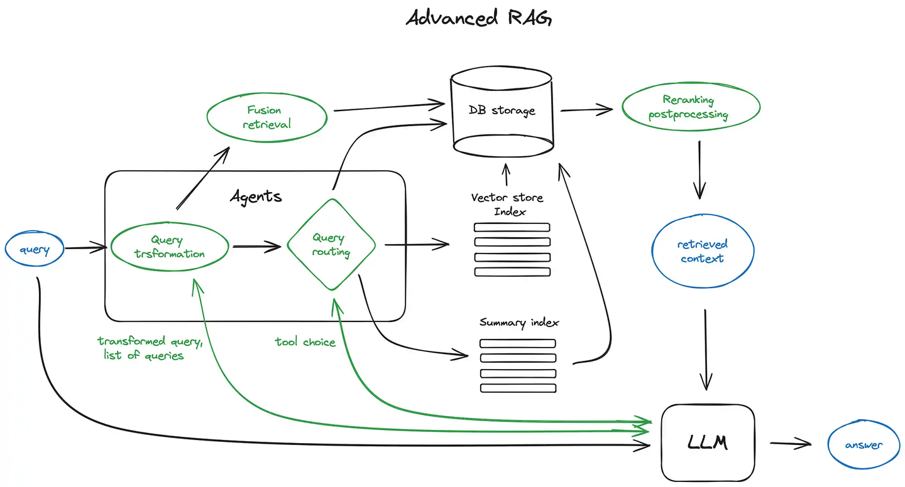
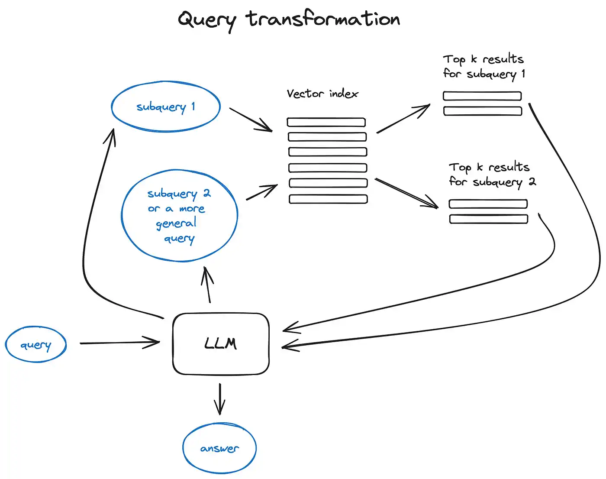

# RAG

当我们将大模型应用于实际业务场景时会发现，通用的基础大模型基本无法满足实际业务需求，主要有以下几方面原因：
- 知识的局限性：模型自身的知识完全源于它的训练数据，而现有的主流大模型（ChatGPT、文心一言、通义千问…）的训练集基本都是构建于网络公开的数据，对于一些实时性的、非公开的或离线的数据是无法获取到的，这部分知识也就无从具备。
- 幻觉问题：所有的AI模型的底层原理都是基于数学概率，其模型输出实质上是一系列数值运算，大模型也不例外，所以它有时候会一本正经地胡说八道，尤其是在大模型自身不具备某一方面的知识或不擅长的场景。而这种幻觉问题的区分是比较困难的，因为它要求使用者自身具备相应领域的知识。
- 数据安全性：对于企业来说，数据安全至关重要，没有企业愿意承担数据泄露的风险，将自身的私域数据上传第三方平台进行训练。这也导致完全依赖通用大模型自身能力的应用方案不得不在数据安全和效果方面进行取舍。

而RAG是解决上述问题的有效方案，RAG（检索增强生成）通过将检索与生成结合，突破了传统语言模型的局限

---------
一句话总结：

RAG（中文为检索增强生成） = 检索技术 + LLM 提示

RAG就是通过检索获取相关的知识并将其融入Prompt，让大模型能够参考相应的知识从而给出合理回答

---------


完整的RAG应用流程主要包含两个阶段：

- 数据准备阶段：数据提取——>文本分割——>向量化（embedding）——>数据入库
- 应用阶段：用户提问——>数据检索（召回）——>注入Prompt——>LLM生成答案


## 数据准备阶段

数据准备一般是一个离线的过程，主要是将私域数据向量化后构建索引并存入数据库的过程。主要包括：数据提取、文本分割、向量化、数据入库等环节

### 数据提取
* 数据加载：包括多格式数据加载、不同数据源获取等，根据数据自身情况，将数据处理为同一个范式。
* 数据处理：包括数据过滤、压缩、格式化等。
* 元数据获取：提取数据中关键信息，例如文件名、Title、时间等 。

### 文本分割
1. 文本分割主要考虑两个因素：
2. embedding模型的Tokens限制情况；
3. 语义完整性对整体的检索效果的影响。一些常见的文本分割方式如下：
- 句分割：以”句”的粒度进行切分，保留一个句子的完整语义。常见切分符包括：句号、感叹号、问号、换行符等。
- 固定长度分割：根据embedding模型的token长度限制，将文本分割为固定长度（例如256/512个tokens），这种切分方式会损失很多语义信息，一般通过在头尾增加一定冗余量来缓解。

### 向量化（embedding）
向量化是一个将文本数据转化为向量矩阵的过程，该过程会直接影响到后续检索的效果。

目前常见的embedding模型如下所示，这些embedding模型基本能满足大部分需求，但对于特殊场景（例如涉及一些罕见专有词或字等）或者想进一步优化效果，则可以选择开源Embedding模型微调或直接训练适合自己场景的Embedding模型。
- ChatGPT-Embedding
- ERNIE-Embedding V1
- M3E
- BGE

### 数据入库

数据向量化后构建索引，并写入数据库的过程可以概述为数据入库过程，适用于RAG场景的数据库包括：`FAISS`、`Chromadb`、`ES`、`milvus`等。一般可以根据业务场景、硬件、性能需求等多因素综合考虑，选择合适的数据库。

## 应用阶段

在应用阶段，可以根据用户的提问，通过高效的检索方法，召回与提问最相关的知识，并融入Prompt

大模型参考当前提问和相关知识，生成相应的答案


关键环节包括：数据检索、注入Prompt等

### 数据检索

常见的数据检索方法包括：相似性检索、全文检索等，根据检索效果，一般可以选择多种检索方式融合，提升召回率。
- 相似性检索：即计算查询向量与所有存储向量的相似性得分，返回得分高的记录。常见的相似性计算方法包括：余弦相似性、欧氏距离、曼哈顿距离等。
- 全文检索：全文检索是一种比较经典的检索方式，在数据存入时，通过关键词构建倒排索引；在检索时，通过关键词进行全文检索，找到对应的记录。

### 注入Prompt

在RAG场景中，Prompt一般包括任务描述、背景知识（检索得到）、任务指令（一般是用户提问）等 ，根据任务场景和大模型性能，也可以在Prompt中适当加入其他指令优化大模型的输出

一个简单知识问答场景的Prompt如下所示：
```markdown
【任务描述】
假如你是一个专业的客服机器人，请参考【背景知识】，回答【问题】
【背景知识】
{content} // 数据检索得到的相关文本
【问题】
石头扫地机器人P10的续航时间是多久？
```


# 高级RAG技术



## 1. 分块 & 向量化
- 分块：对数据进行分块————将初始文档拆分为一定大小的块，而不会失去其含义。有许多文本拆分器实现能够完成此任务，块的大小取决于所使用的嵌入模型以及模型需要使用 token 的容量。如基于 BERT 的句子转换器，最多需要 512 个 token，OpenAI ada-002 能够处理更长的序列，如 8191 个 token，但这里的折衷是 LLM 有足够的上下文来推理
- 向量化：选择一个搜索优化的模型来嵌入块。有很多选项，比如 bge-large 或 E5 嵌入系列

## 2. 搜索索引
### 2.1 向量存储索引
- 向量存储索引：为了实现1w+元素规模的高效检索，搜索索引应该采用向量索引，比如 faiss、nmslib 以及 annoy。这些工具基于近似最近邻居算法，如聚类、树结构或HNSW算法（LlamaIndex 支持多种向量存储索引，同时也兼容其他简单的索引类型，如列表索引、树索引和关键词表索引）
- 分层索引：在大型数据库的情况下，一个有效的方法是创建两个索引——一个由摘要组成，另一个由文档块组成，然后分两步进行搜索，首先通过摘要过滤掉相关文档，然后只在这个相关组内搜索
### 2.2. 假设性问题和 HyDE
- 假设性问题：让 LLM 为每个块生成一个问题，并将这些问题嵌入到向量中，在运行时对这个问题向量的索引执行查询搜索（将块向量替换为索引中的问题向量），然后在检索后路由到原始文本块并将它们作为 LLM 获取答案的上下文发送
- HyDE：要求 LLM 在给定查询的情况下生成一个假设的响应，然后将其向量与查询向量一起使用来提高搜索质量
### 2.3. 内容增强
将相关的上下文组合起来供 LLM 推理，获得更好的搜索质量
- 一种是围绕较小的检索块的句子扩展上下文
- 另一种是首先在检索过程中获取较小的块，然后如果前 k 个检索到的块中有超过 n 个块链接到同一个父节点（较大的块），将这个父节点替换成给 LLM 的上下文——工作原理类似于自动将一些检索到的块合并到一个更大的父块中
### 2.4. 融合检索或混合搜索：
结合传统的基于关键字的搜索（稀疏检索算法，如 tf-idf 或搜索行业标准 BM25）和现代语义或向量搜索，并将其结果组合在一个检索结果中

## 3. 重排（reranking）和过滤（filtering）

使用上述任何算法获得了检索结果，然后通过过滤、重排或一些转换来完善
> 在 LlamaIndex 中，有各种可用的后处理器，根据相似性分数、关键字、元数据过滤掉结果，或使用其他模型（如 LLM）、sentence-transformer 交叉编码器，Cohere 重新排名接口或者基于元数据重排它们

将检索到的上下文提供给 LLM 以获得结果答案之前的最后一步

--------------

> 接下来，将讨论更高级的 RAG 技术，比如查询转换和路由。这些技术涉及到大语言模型的使用，代表了一种更复杂的逻辑思维——在 RAG 流程中融合了 LLM 的推理能力

## 4. 查询转换

查询转换是一系列技术，使用 LLM 作为推理引擎来修改用户输入以提高检索质量



**对于复杂的查询，大语言模型能够将其拆分为多个子查询。** 比如，

- 当你问：“在 Github 上，Langchain 和 LlamaIndex 这两个框架哪个更受欢迎？”

一般不太可能直接在语料库找到它们的比较，所以将这个问题分解为两个更简单、具体的合理的子查询：
- "Langchain 在 Github 上有多少星？"
- "Llamaindex 在 Github 上有多少星？"
这些子查询会并行执行，检索到的信息随后被汇总到一个 LLM 提示词中

## 5. 聊天引擎

通过查询压缩技术解决的，将聊天上下文与用户查询一起考虑在内

## 6. 查询路由

定义查询路由器包括设置它可以做出的选择，如果是涉及到关联操作，这些查询还可能被发送到子链或其他智能体

通常是总结、对某些数据索引执行搜索或尝试许多不同的路由，然后将它们的输出综合到一个答案中

> 比如文档智能体都有两个工具：向量存储索引和摘要索引，它根据路由查询决定使用哪一个。对于顶级智能体来说，所有文档智能体都是其工具


## 7. 响应合成

响应合成的主要方法有：
* 通过将检索到的上下文逐块发送到 LLM 来优化答案
* 概括检索到的上下文，以适应提示
* 根据不同的上下文块生成多个答案，然后将它们连接或概括起来

## 未来发展方向

- **多模态RAG**：结合图像、音频等数据进行检索和生成
- **高效检索**：优化检索速度，适应实时应用
- **自适应知识库**：让模型自动识别并且补充知识库

# 参考
1. https://zhuanlan.zhihu.com/p/675509396