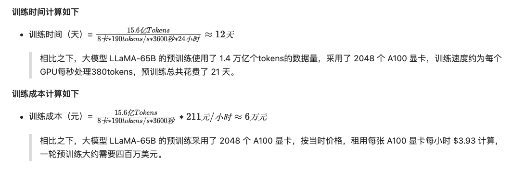
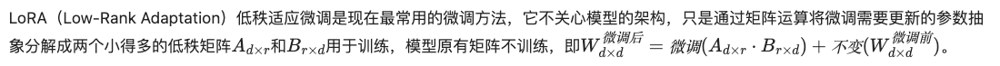

# 阿里云大模型高级工程师ACP认证
> https://github.com/AlibabaCloudDocs/aliyun_acp_learning


## 2.1 大模型基础知识

大模型的问答工作流程
- 输入文本Token化
- Token向量化
- 大模型推理
- 输出Token：影响大模型生成内容的参数`temperature`和`top_p`
- 输出文本


### 2.1.1 temperature 调整候选Token集合的概率分布

- 想要明确的答案：temperature设置越小
- 想要创意多样的答案：temperature设置越大


### 2.1.2 top_p 控制候选Token集合的采样范围

- top_p越大：候选范围越广，适合多样性答案
- top_p越小：候选范围越小，适合代码生成需要明确答案的场景
- top_p取极小值：理论上模型只选择概率最高的token，输出非常稳定

### 2.1.3 上下文工程（Context Engineering）

- RAG
- Prompt
- Tool
- Memory


## 2.3 Prompt

- 任务目标：明确要求大模型完成什么任务，让大模型专注具体目标
- 上下文：任务的背景信息，比如操作流程、任务场景等，明确大模型理解讨论的范围
- 角色：大模型扮演的角色，或者强调大模型应该使用的语气、写作风格等，明确大模型回应的预期情感
- 受众：明确大模型针对的特定受众，约束大模型的应答风格
- 样例：让大模型参考的具体案例，大模型会从中抽象出实现方案、需要注意的具体格式等信息
- 输出格式：明确指定输出的格式、输出类型、枚举值的范围。通常也会明确指出不需要输出的内容和不期望的信息，可以结合样例来进一步明确输出的格式和输出方法


## 2.4 RAG自动化评测


评估纬度：
- 召回质量：RAG系统是否检索到了正确且相关的文档片段
- 答案忠实度：生成的答案是否完全基于检索到的上下文，没有幻觉
- 答案相关性：生成的答案是否准确回答了用户的问题
- 上下文利用率/效率：大模型是否有效利用了所有提供给它的上下文信息

### 2.4.1 流行的RAG评测框架

#### 2.4.1.1 Ragas

在评测时，Ragas 会调用一个大模型作为评测专家来阅读你的问题、RAG检索到的上下文和生成的答案，然后根据预设的指标给出分数。Ragas的评估指标高度契合RAG系统的痛点，主要包括：
- 整体回答质量的评估：
  - Answer Correctness，用于评估 RAG 应用生成答案的准确度。
- 生成环节的评估：
  - Answer Relevancy，用于评估 RAG 应用生成的答案是否与问题相关。
  - Faithfulness，用于评估 RAG 应用生成的答案和检索到的参考资料的事实一致性。
- 召回阶段的评估：
  - Context Precision，用于评估 contexts 中与准确答案相关的条目是否排名靠前、占比高（信噪比）。
  - Context Recall，用于评估有多少相关参考资料被检索到，越高的得分意味着更少的相关参考资料被遗漏。


#### 2.4.1.2 TruLens

专注于评估的`可观测性`
- 告诉你RAG哪里可能有问题
- 还能帮你追溯RAG整个运行过程，包括每次运行的输入、输出、中间步骤、调用的大模型、检索召回的上下文等等；并提供一系列`反馈函数`来自动化评估这些运行


可以和`langChain`、`LlamaIndex`无缝集成，并提供一套可视化工具，展示每次RAG调用的详细过程

提供细粒度的反馈函数，从多个角度评估RAG性能，帮助你快速定位问题，评估指标包括：
- Context Relevance：评估召回的知识是否跟问题相关。
- Groundedness：生成的答案是否是来自于检索召回的知识
- Answer Relevance：生成的答案是否与问题相关

#### 2.4.1.3 DeepEval

将传统的软件开发测试理念引入到RAG应用中，在RAG功能开发前就编写评估测试，采用单元测试和测试驱动开发TDD的思想，提供一个专门的测试框架，让你能够编写单元测试一样，为RAG系统创建LLM评估测试

支持为每个测试用例设置明确的通过/失败的阀值，轻松集成到你的CI/CD流程，从而实现自动化回归测试


#### 2.4.1.4 其他的开源评测工具

比如LlamaIndex和LangChain这些主流RAG开发框架本身也有内置评估工具

#### 2.4.1.5 自定义评测框架


在某些特定场景下，你可能需要更灵活、更贴合业务的评估方式，这时你也可以选择自定义评测框架

> 请注意：领域专家的深度参与是评测系统乃至AI应用成功的关键。使用自动化评测框架并非要让机器彻底取代人工判断，而是旨在为评测提效。前面介绍的许多自动化框架（如Ragas）会利用大模型来充当“评委”，对RAG表现进行初步判断。然而，只有领域专家才能提供那些最宝贵的、真正反映业务需求的高价值“正确答案”（Ground Truth），并对用户提问和RAG回答的正确性进行权威性的审定。


案例一：当用户询问“报销的流程是什么？”，你们的业务专家可能会要求“好的报销答案，必须明确包含报销单链接和二级主管审批信息。”或者“好的答案，必须引导用户到费用系统提交报销申请。”，这样才能满足“流程合规”的要求。


#### 2.4.1.6 评测示例讲解

> https://github.com/AlibabaCloudDocs/aliyun_acp_learning/blob/main/%E5%A4%A7%E6%A8%A1%E5%9E%8BACP%E8%AE%A4%E8%AF%81%E6%95%99%E7%A8%8B/p2_%E6%9E%84%E9%80%A0%E5%A4%A7%E6%A8%A1%E5%9E%8B%E9%97%AE%E7%AD%94%E7%B3%BB%E7%BB%9F/2_4_%E8%87%AA%E5%8A%A8%E5%8C%96%E8%AF%84%E6%B5%8B%E7%AD%94%E7%96%91%E6%9C%BA%E5%99%A8%E4%BA%BA%E7%9A%84%E8%A1%A8%E7%8E%B0.ipynb


## 2.5 评测不理想->优化RAG具体步骤

### 2.5.1. 切片方式的优化
- 如果你刚开始接触 RAG，建议先使用默认的句子切片方法，它在大多数场景下都能提供不错的效果
- 当你发现检索结果不够理想时，可以尝试：
  - 处理长文档且需要保持上下文？试试句子窗口切片
  - 文档逻辑性强、内容专业？语义切片可能会有帮助
  - 模型总是报 Token 超限？Token 切片可以帮你精确控制
  - 处理 Markdown 文档？别忘了有专门的 Markdown 切片

### 2.5.2. Embedding模型
- 新版本的Embedding模型通常能带来更好的效果（如text-embedding-v3比v2表现更好）
- 在实践中，单纯升级Embedding模型就可能显著提升检索质量

### 2.5.3. Embedding存储数据库
- 开发测试时使用内存向量存储
- 小规模应用可以使用本地向量数据库
- 生产环境推荐使用云服务，可根据具体需求选择合适的服务类型

### 2.5.4. 检索召回阶段
- 在执行检索前，很多用户问题描述是不完整、甚至有歧义的，你需要想办法还原用户真实意图，以便提升检索效果。
- 在执行检索后，你可能会发现存在一些无关的信息，需要想办法减少无关信息，避免干扰下一步的答案生成。

#### 2.5.4.1 问题改写
- 使用大模型扩充用户问题
- 将单一查询改写为多步骤查询
- 用假设文档来增强检索（HyDE）

> 在向量检索的基础上，我们还可以添加标签过滤来提升检索精度。这种方式类似于图书馆既有书名检索，又有分类编号系统，能让检索更精准

#### 2.5.4.2 标签提取有两个关键场景
- 建立索引时，从文档切片中提取结构化标签
- 检索时，从用户问题中提取对应的标签进行过滤

当我们建立索引时，可以将这些标签与文档切片一起存储。这样在检索时，比如用户问"张伟是哪个部门的"，我们可以：
- 从问题中提取人名标签 {"key": "人名", "value": "张伟"}
- 先用标签过滤出所有包含"张伟"的文档切片
- 再用向量相似度检索找出最相关的内容

这种"标签过滤+向量检索"的组合方式，能大幅提升检索的准确性。特别是在处理结构化程度较高的企业文档时，这个方法效果更好。

#### 2.5.4.3 重排序

增加召回数量，利用重排序获取分数更高的片段

#### 2.5.4.4 生成答案阶段

即使上面几个步骤都优化好了，你仍然会遇到：
- 没有检索到相关信息，大模型捏造答案。
- 检索到了相关信息，但是大模型没有按照要求生成答案。
- 检索到了相关信息，大模型也给出了答案，但是你希望 AI 给出更全面的答案。


这个能做的是：
- 选择合适的大模型
- 充分优化prompt内容
- 调整大模型参数
- 调优大模型


> GraphRAG 技术巧妙地结合了检索增强生成（RAG）和查询聚焦摘要（QFS）的优点，为处理大规模文本数据提供了一个强大的解决方案。它把两种技术的特长融合在一起：RAG 擅长找出精确的细节信息，而 QFS 则更善于理解和总结文章的整体内容。通过这种结合，GraphRAG 既能准确回答具体问题，又能处理需要深入理解的复杂查询，特别适合用来构建智能问答系统。
如果你想深入了解如何实际运用 GraphRAG，可以参考 LlamaIndex 提供的详细教程：使用 LlamaIndex 构建 GraphRAG 应用


## 2.6 Agent

智能体的工作原理：
1. 工具模块
2. 记忆模块
3. 计划能力
4. 行动能力


### 2.6.1 意图识别

对用户的问题进行意图识别后，你就可以让答疑机器人先识别问题的类型，再使用不同的提示词和工作流程来回答问题
- 节省资源：对于检查文档错误的问题，大模型其实可以直接回复，并不需要检索参考资料，之前的实现存在资源浪费。
- 避免误解：之前的实现每次会检索参考资料，这些被召回的相关文本段可能会干扰大模型理解问题，导致答非所问。

```python
def ask_llm_route(question):
    question_type = get_question_type(question)
    print(f'问题：{question}\n类型：{question_type}')
  
    reviewer_prompt = """
    【角色背景】
    你是文档纠错专家，负责找出文档中或网页内容的明显错误
    【任务要求】
    - 你需要言简意赅的回复。
    - 如果没有明显问题，请直接回复没有问题\n
    【输入如下】\n"""
  
    translator_prompt = """
   【任务要求】
    你是一名翻译专家，你要识别不同语言的文本，并翻译为中文。
    【输入如下】\n"""

    if question_type == '文档审查':
        return llm.invoke(reviewer_prompt + question)
    elif question_type == '公司内部文档查询':
        return rag.ask(question, query_engine=query_engine)
    elif question_type == '内容翻译':
        return llm.invoke(translator_prompt + question)
    else:
        return "未能识别问题类型，请重新输入。"

query_engine =rag.create_query_engine(index=rag.load_index())
```

### 2.6.2 多智能体

Multi-Agent系统有多种设计思路，本教程将介绍一个由
- 一个Planner Agent：根据用户的输入内容，选择要将任务分发给哪个Agent或Agent组合完成任务
- 若干个负责执行工具函数的Agent：根据Planner Agent分发的任务，执行属于自己的工具函数
- 一个Summary Agent组成的Multi-Agent系统：根据用户的输入，以及执行工具函数的Agent的输出，生成总结并返回给用户

组成的多智能体系统

### 2.7 微调

> 需要先掌握模型训练的一些基础知识，可以看“李宏毅”相关B站视频学习


- 神经网络（多层）：万能函数逼近器
- 梯度下降：常见的实现方式-先在曲面（或曲线）上随机选择一个起点，然后通过不断小幅度调整参数，最终找到最低点（对应最优参数配置）

通过不断调整参数，找到最适合的参数集合就是我们模型训练的目的（本质就是暴力穷举所有可能的参数，然后通过一些科学的方式进行剪枝，然后使用科学的方法评估这个参数是否满足然后停止训练）
> 当然可能要调整很久才能知道想要的参数组合！所以训练模型消耗的资源是非常庞大的


- `batch size`：
- `eval steps`：因为训练集通常数量很大，人们通常不会在对训练集进行完整的迭代后，再使用验证集做评估（evaluation），而是会选择每间隔多少个训练步骤，就用验证集进行一次评估。这个间隔步骤数，通常是通过 eval_steps 参数来控制
- `epoch`：对训练集进行一次完整的迭代，被称为一个 epoch（每次训练会多次epoch）


#### 2.7.1 预训练和微调

你在最开始下载的模型，就是预训练好的参数组合

微调是在这个预训练好的参数基础上，进一步训练调整参数，以适应你的目标任务！

#### 2.7.2 训练成本

显存要求：
- 1.5B参数占用内存（假设按全精度 FP32 ，单参数占用4字节）：
- 一般对模型进行训练时，大概需要模型参数内存的7~8倍，也就是约45GB的显存。这个显存占用基本上超过了大多数显卡的配置，也超过了你的GPU实验环境显存。


假设你在阿里云官网上创建了一个有 8张 V100 显卡的ECS实例，这个实例有256GB的显存，完全满足你的模型对显存的需求。接下来，你可以用下述的方法估算一下训练时间和成本：
- 训练数据总量：为了满足业务上的精度需要，假设你需要的训练数据量大约相当于两千本红楼梦（假设78万字一本），即大约 15.6亿个token。
- 单位训练速度：假设你使用的 V100 显卡每秒钟可处理 190个tokens。
- 单位训练成本：在阿里云官网查到 8张 V100 显卡的ECS实例，每小时价格大约 211元。

那么完成一轮微调训练大概需要 12 天，约 6万元。



#### 2.7.3 微调步骤

> 预训练一般通过`自监督/无监督`方式学习，学习的数据来自互联网上的海量文本，让模型自己从数据中找规律。这种学习方式因为其数据无需人工标注，省去了大量人力成本，天然适用于海量数据的学习
>
> 微调通过`有监督`学习，通过针对特定任务的小规模标注数据，并用标注数据直接教模型学习任务，这种学习方式由于人工标注成本高，难以扩展为海量数据，因此更适合有明确场景目标的模型训练，所需要的样本数量通常只有几千或者几万条

1. 直接选择预训练模型（如Qwen、DeepSeek、GPT）
2. 根据自己的实际场景，微调模型（通过只需要构建几千条适用于实际场景的标注数据），因为训练数据总Tokens数大大降低，使得训练时间有效缩减，从而进一步降低训练成本

#### 2.7.4 微调
> 模型参数量是影响显存需求的主要原因，从调整参数量的大小这个角度，可以把微调分为`全参微调`和`高效微调`

- `全参微调`：在预训练模型的基础上进行全量参数微调的模型优化方法 => 避免消耗重新开始训练模型所有参数所需要的大量计算资源，又能避免部分参数未被微调导致的模型性能下降 => 但是训练成本还是很高的
- `高效微调技术`：通过调整少量参数，显著降低大模型微调的计算成本，同时保持性能接近全参训练，典型方法包括：
  - `Adapter Tuning`
  - `Prompt Tuning`
  - `LoRA`：仅需训练适配的小参数矩阵（即低秩矩阵，仅需原模型0.1%-1%的参数），成为资源受限场景下的首选方案
  
#### 2.7.5 LoRA微调


#### 2.7.6 微调实践-模型训练的状态与指标

模型要经过三套题目的考验，产生两个指标，来确定模型训练所处于的状态

三套题目：
- 训练集：课程练习册，带详细答案解析，模型会反复练习，并基于损失函数产生`训练损失（training loss）`
- 验证集：模拟考试题，模型每学习一段时间，就会测试一次，并基于损失函数产生`验证损失（evaluation loss）`
- 测试集：考试真题。模型在测试集上的准确率用于评估最终的模型表现

模型训练的三个状态：
- `训练损失`不变，甚至变大：说明训练`失败` => 你可以理解为模型在训练集（练习册）上没有学习到知识，说明模型的学习方法有问题
- `训练损失`和`验证损失`都在下降：说明模型`欠拟合` => 你可以想象成模型在训练集（练习册）上的学习有进步，验证集（模拟考试）的表现也变好了，但还有更多的进步空间。这时候你应该让模型继续学习
- `训练损失`下降但`验证损失`上升：说明模型`过拟合` => 你可以理解为模型只是背下了训练集（练习册），在模型考试中遇到了没背过的题反而做不来了。这种场景需要通过一些方法去抑制模型的背题倾向，比如再给它20本练习册，让它记不住所有的题，而是逼它去学习题目里面的规律。


#### 2.7.7 迭代式调参实验：通过多次学习率/数据量/训练轮次调整，解决欠拟合与过拟合问题，最终显著提升模型解题准确率

(比较复杂，暂时省略...)


### 2.8 大模型部署


### 2.9 大模型应用生产实践

### 2.10 大模型安全

