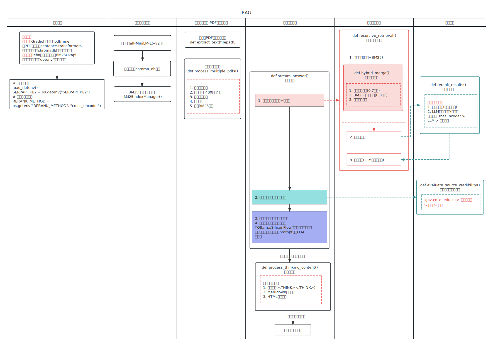
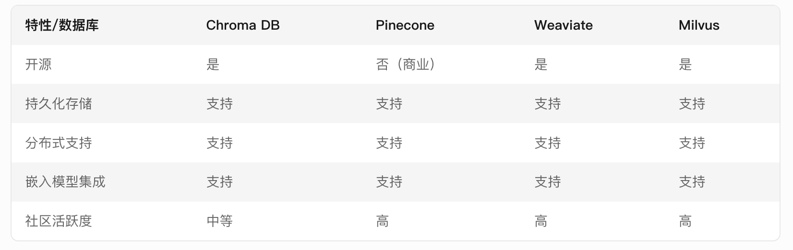
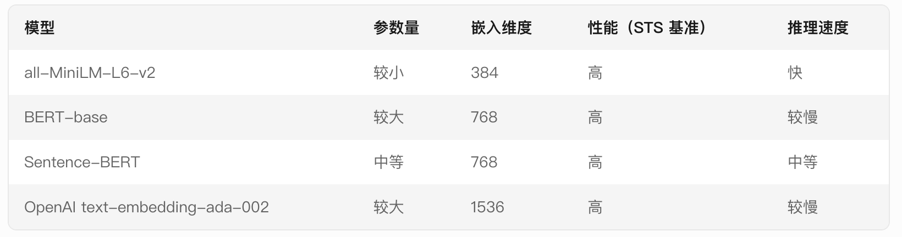

# Local_Pdf_Chat_RAG

参照 https://github.com/weiwill88/Local_Pdf_Chat_RAG 进行动手实践RAG整套流程的搭建，旨在学习RAG的基础知识，从而更好地理解主流开源RAG库代码的精髓以及进行二次开发




## Chroma DB

Chroma DB 是一个开源的向量数据库（Vector Database），专门设计用于存储、检索和管理向量嵌入（Embeddings）。它是为机器学习和人工智能应用（如自然语言处理、图像处理等）量身定制的，能够高效地处理高维向量数据

**适用场景**
- 语义搜索：基于文本嵌入的语义相似性搜索。
- 推荐系统：通过向量相似性为用户推荐内容。
- 图像检索：基于图像嵌入的相似图像搜索。
- 问答系统：基于嵌入的问答和知识检索。
- 聚类和分类：对高维向量数据进行聚类或分类




## all-MiniLM-L6-v2


all-MiniLM-L6-v2 是一个基于 Transformer 架构的轻量级语言模型，专门用于生成高质量的文本嵌入（Text Embeddings）。它是由 Microsoft 团队开发的，属于 MiniLM 系列模型之一，旨在提供高效且性能优异的文本表示能力，适用于各种自然语言处理（NLP）任务（如语义搜索、文本分类、聚类、问答系统等）




## BM25

BM25（Best Match 25）是一种经典的信息检索算法，用于衡量文档与查询之间的相关性。它是 TF-IDF（Term Frequency-Inverse Document Frequency）的改进版本，旨在更准确地评估文档在给定查询下的匹配程度。BM25 是搜索引擎和全文检索系统中广泛使用的算法之一


BM25 的核心思想是通过以下两个因素来评估文档的相关性：
- 词频（Term Frequency, TF）：查询中的词在文档中出现的频率。
- 逆文档频率（Inverse Document Frequency, IDF）：查询中的词在整个文档集合中的稀有程度。
BM25 在 TF-IDF 的基础上引入了文档长度归一化，以解决长文档可能包含更多无关词汇的问题。

适用场景
- 搜索引擎：用于网页、文档等全文检索。
- 问答系统：基于关键词匹配的问答检索。
- 推荐系统：通过关键词匹配推荐相关内容。

示例代码：
```python
from rank_bm25 import BM25Okapi

# 文档集合
documents = [
    "The cat sat on the mat.",
    "The dog played in the yard.",
    "Cats and dogs are pets."
]

# 分词
tokenized_docs = [doc.split() for doc in documents]

# 初始化 BM25
bm25 = BM25Okapi(tokenized_docs)

# 查询
query = "cat dog"
tokenized_query = query.split()

# 计算得分
scores = bm25.get_scores(tokenized_query)
print(scores)

# 返回最相关的文档
best_doc_index = scores.argmax()
print("Best document:", documents[best_doc_index])
```

## jieba

jieba 是一个流行的 Python 中文分词库，专门用于将中文文本切分成词语（即分词）。它是中文自然语言处理（NLP）任务中常用的工具之一，具有高效、易用和功能丰富的特点

**适用场景**
- 中文文本预处理：用于机器学习或深度学习的文本数据预处理。
- 搜索引擎：构建中文搜索引擎的分词模块。
- 文本分析：如情感分析、主题建模等。
- 信息提取：如关键词提取、实体识别等。